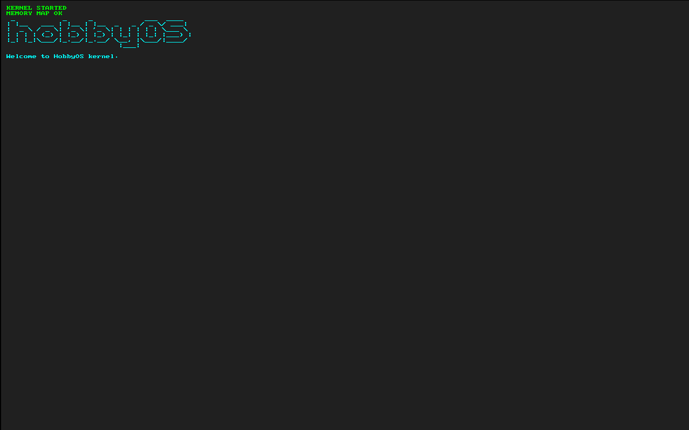

<h1 align="center">hobbyOS</h1>

<p align="center">
  A toy <strong>x86-64 operating system</strong> — from UEFI firmware to pixels on screen.
</p>

<p align="center">
  
  
  
  
  
</p>

---

<p align="center">
  
</p>

---
hobbyOS is a small operating system built for learning the full boot path: a
UEFI bootloader loads an ELF64 kernel, hands over a boot-information structure,
and jumps into a kernel that renders text over the graphics framebuffer.

## Boot flow

```text
UEFI firmware (OVMF)
      │  launches EFI/BOOT/BOOTX64.EFI
      ▼
UEFI bootloader  ──  interactive shell (built on HobShell)
      │  load kernel.elf
      │    • parse ELF64, map PT_LOAD segments, zero BSS
      │    • fill BootInfo: framebuffer (GOP) + memory map
      │    • ExitBootServices, jump with BootInfo in %rdi
      ▼
kernel  ──  renders text to the framebuffer with an 8x8 font
```

## Components

| Path | What it is |
|------|-----------|
| [`bootloader/uefi/`](bootloader/uefi/) | UEFI bootloader — the [HobShell](https://github.com/Soham-Kakkar/HobShell) shell plus a `load` command that loads and boots an ELF64 kernel |
| [`kernel/`](kernel/) | freestanding kernel: framebuffer text output with an 8x8 bitmap font |
| [`common/`](common/) | `bootinfo.h` — the boot-protocol ABI shared by bootloader and kernel |

## Quick start

**Prerequisites**

| Tool | Purpose | Arch package |
|------|---------|--------------|
| `clang` + `lld` | build the bootloader (PE) and kernel (ELF) | `clang lld` |
| gnu-efi headers | UEFI definitions for the bootloader | `gnu-efi` |
| `qemu-system-x86_64` | run the OS | `qemu-full` |
| OVMF firmware | UEFI firmware for QEMU | `edk2-ovmf` |

**Build & run**

```sh
# build kernel.elf and BOOTX64.EFI (both staged into the disk image)
make all

# supply OVMF firmware for QEMU (gitignored; from your distro)
mkdir -p bootloader/uefi/OVMF
cp /usr/share/edk2/x64/*.fd bootloader/uefi/OVMF/

# boot it
make uefirun
```

At the `boot>` prompt, load the kernel from the boot volume:

```text
boot>ls
boot>load kernel.elf
```

The bootloader loads the ELF, exits boot services, and jumps into the kernel,
which paints text to the screen.

> OVMF paths and filenames vary by distro — see the note in
> [`bootloader/uefi/README.md`](bootloader/uefi/README.md). Keep a per-project
> **writable** copy of `OVMF_VARS`.

## Make targets

| Target | Action |
|--------|--------|
| `make all` | build kernel + bootloader |
| `make kernel` | build the kernel only |
| `make uefiboot` | build the bootloader only |
| `make uefirun` | launch QEMU |
| `make clean` | remove build artifacts |

## Related

The bootloader shares its shell foundation with
**[HobShell](https://github.com/Soham-Kakkar/HobShell)**, a standalone UEFI-app
project. HobShell is the general-purpose firmware shell; hobbyOS extends it with
the OS-specific `load` command and the `BootInfo` handoff to the kernel.
